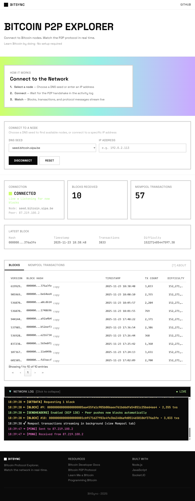

# Bitcoin Blockchain P2P Explorer

A **Node.js** Bitcoin Blockchain explorer - streams real-time bitcoin data. Implemented in **pure Javascript** for learning purposes.

**[Live Demo](https://bitcoin-explorer-production.up.railway.app)**

**Tech Stack**
---
- Node.js
- Express
- Net
- Socket.IO
 

**References**
---
This project heavily references Jimmy Song's *Programming Bitcoin* for implementation of the Bitcoin networking protocols. 

Additional references: [Bitcoin Protocol Documentation](https://en.bitcoin.it/wiki/Protocol_documentation), [bitcoin.org](https://bitcoin.org/en/), [Learn me a Bitcoin](https://learnmeabitcoin.com) by Greg Walker
